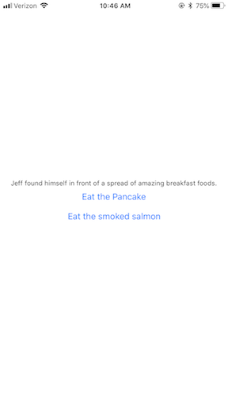

# Building your first app

## Setup:

#### :white_check_mark: To Do
* [Download Expo for Mac](https://xde-updates.exponentjs.com/download/mac).
  - Create an Expo account
* Download Expo Client mobile app: [Android](https://play.google.com/store/apps/details?id=host.exp.exponent), [iOS](https://play.google.com/store/apps/details?id=host.exp.exponent)
  - Sign into expo mobile app
* [Download Sublime Text for Max](https://download.sublimetext.com/Sublime%20Text%20Build%203170.dmg)

#### What tools are available to build apps?
* *xCode* -- Apple's software to build iOS apps. Languages: Objective-C, Swift
* *Android Studio* -- Google's software to build Android apps. Languages: Java
* Expo -- Software to build iOS or Android apps. Language: JavaScript (React-Native)

#### Why are we using React Native / Expo?
* Cross-platform
* Can't do EVERYTHING, but can do the things we need
* Much better workflow for building and testing

## Build the app:

#### App features:
* Choose your own adventure book
* Offer a binary option after each narration to determine what the next step will be

#### Example:


#### :white_check_mark: To Do
* In expo desktop app, create new project
  - Template: Blank
  - Name: "choose-your-own-adventure"
  - Change save location to the Desktop
* In expo mobile app, go to projects tab
  - Open your project
  - Close the menu that pops up
  - You should see a screen that says "Open up App.js to start working on your app!"
* Open Sublime Text editor
  - File > Open
  - Find the folder "choose-your-own-adventure" on the Desktop
  - Open the entire folder (Click the folder, but not into the folder. Click open)
  - You should see a table-of-contents on the left panel
* Go to App.js
  - Find the `<Text>` and `</Text>` tags. Inside these tags it says: "Open up App.js to start working on your app!"
  - Change this text to "I am <YOUR NAME> and I build apps."
  - Save the file and look at your phone screen. When it finishes loading, you should see the text updated!

#### How does this work?
* There are several ways to work on mobile apps. The traditional way is to plug your phone into your computer and use xcode to build and test your app
* This company called expo has made things much easier for us by taking care of many of the details online! Thanks Expo!
* They live stream the changes you are making locally to a sever online that then relays them to your mobile device. Pretty crazy!

#### Step 1: Set up the interface
* We want to create the screen that has the story and two buttons

Imports -- At the top of the screen you'll see the text `import` with some brackets and other text after it. In software development, everything is broken into little pieces of code that do specific things. Then, you use whichever pieces you need for what you are building.

#### :white_check_mark: To Do
* Add `Button` to the list of imports. It should look like this when you are done:

```
import { StyleSheet, Text, View, Button } from 'react-native';
```

Hierarchy -- When designing interfaces, everything is a series of boxes nested inside of eachother. You don't see the borders of the boxes unless you change their styling to see them, but they are there underneath. It's like building with legos!

A `View` is just a blank box that you can put things in to add structure to your code
A `Button` is just what it sounds like. Something that responds to touch and performs an action
A `Text` element is one that holds text
A `Stylesheet` gives you a place to add the styling for your components (`View`, `Button`, etc. are all components)

Based on the screen shots, we know we need 1 `Text` element and two `Button` elements (1 for each choice)

Luckily they already gave us one text element

#### :white_check_mark: To Do
* Change the text inside the text element to read "Jeff found himself in front of a spread of amazing breakfast foods." (This is the beginning of our story)
* Add two button elements. The button elements will need an `attribute` called `title` that determines what text is shown inside the button. In our case, this is the action the reader is taking.
  - The title of button 1 is: "Eat the Pancake"
  - The title of button 2 is: "Eat the Smoked Salmon"

When you are done, your code will look like this:
```
<View style={styles.container}>
  <Text>Jeff found himself in front of a spread of amazing breakfast foods.</Text>
  <Button title="Eat the Pancake"/>
  <Button title="Eat the Smoked Salmon"/>
</View>

```

You probably noticed that if you press the buttons, nothing happens! You also have a warning that you didn't set `onPress` for the buttons. We'll handle that in a little bit.

#### Step 2: Generalize

Great, we have the very basics of the interface. Now we have two options:
  - Copy and past this code a bunch of times and change it for each of our possible story choices
  - Come up with a way to use this code for each screen, just changing the text

The second option is the right approach. In software development we beleive in keeping our code DRY.
* Do Not
* Repeat
* Yourself

This means we want to re-use code as much as possible.

To do so, we are going to create some "Objects" that have all the information we need to render 1 page of our book. Then we'll refernce these objects in the code.

Our object will look like this:
```
const objectName = {
  "story": <The text we want to display>,
  "option1Text": <The text for button 1>,
  "option2Text": <The text for button 1>,
  "option1NextCase": <The object that represents the page you want to go to if they select option 1>,
  "option2NextCase": <The object that represents the page you want to go to if they select option 2>,
}
```

Here are the options I came up with for my story:

```
const throwUp = {
  "story": "Jeff threw up. The End!",
}

const creepyHouse = {
  "story": "Jeff got eaten by a robot.",
}

const salmonella = {
  "story": "Jeff got salmonella and died.",
}


const run = {
  "story": "The pancake was delicious. Jeff then went for a long run in the woods",
  "option1Text": "Take some Tums",
  "option2Text": "Throw up and go eat the pancakes",
  "option1NextCase": salmon,
  "option2NextCase": salmon,
}

const salmon = {
  "story": "The salmon gave him an upset stomach",
  "option1Text": "Take some Tums",
  "option2Text": "Throw up and go eat the pancakes",
  "option1NextCase": salmonella,
  "option2NextCase": throwUp,
}

const pancake = {
  "story": "The pancake was delicious. Jeff then went for a long run in the woods",
  "option1Text": "Run past the creepy house",
  "option2Text": "Run to the ice cream store",
  "option1NextCase": creepyHouse,
  "option2NextCase": salmonella,
}

const beginning = {
  "story": "Jeff found himself in front of a spread of amazing breakfast foods.",
  "option1Text": "Eat the Pancake",
  "option2Text": "Eat the smoked salmon",
  "option1NextCase": pancake,
  "option2NextCase": salmon,
}
```

#### :white_check_mark: To Do
* Add these options to your file above the line `export default class App extends Component {`
* On a peice of paper, see if you can draw the progression of the story. Remember, if someone presses button 1 (The button that shows `option1Text` they will be taken to a page that shows the contents of `option1NextCase`)

Now, we need to adjust our code so that it uses the values we have in our objects. First, we'll set it up to just reference the `beginning` object. Then, we'll make it so that you can advance the pages by clicking the buttons.

We will need a way to track where we are at in the story. Anytime you are trying to track information inside an app, it is referred to as the app's "state".

#### :white_check_mark: To Do
* Add the following code directly after the line: `export default class App extends Component {`:

```
state = {
  currentPage: beginning
}
```

This let's us know that we want our app to start on the first page (our `beginning` object). Later on, we will update this value based on what page we are on.

#### :white_check_mark: To Do
* Replace the text inside the `<Text>` element and both `<Button>` elements' title attribute to reflect the values of the `currentPage`. To access the `state` object, you write `this.state.currentPage` followed by a period and whichever attribute you care about from the `beginning` object. For example `this.state.currentPage.story` would give you "Jeff found himself in front of a spread of amazing breakfast foods."

Your code will look like this:
```
import React from 'react';
import { StyleSheet, Text, View, Button } from 'react-native';

const throwUp = {
  "story": "Jeff threw up. The End!",
}

const creepyHouse = {
  "story": "Jeff got eaten by a robot.",
}

const salmonella = {
  "story": "Jeff got salmonella and died.",
}


const run = {
  "story": "The pancake was delicious. Jeff then went for a long run in the woods",
  "option1Text": "Take some Tums",
  "option2Text": "Throw up and go eat the pancakes",
  "option1NextCase": salmon,
  "option2NextCase": salmon,
}

const salmon = {
  "story": "The salmon gave him an upset stomach",
  "option1Text": "Take some Tums",
  "option2Text": "Throw up and go eat the pancakes",
  "option1NextCase": salmonella,
  "option2NextCase": throwUp,
}

const pancake = {
  "story": "The pancake was delicious. Jeff then went for a long run in the woods",
  "option1Text": "Run past the creepy house",
  "option2Text": "Run to the ice cream store",
  "option1NextCase": creepyHouse,
  "option2NextCase": salmonella,
}

const beginning = {
  "story": "Jeff found himself in front of a spread of amazing breakfast foods.",
  "option1Text": "Eat the Pancake",
  "option2Text": "Eat the smoked salmon",
  "option1NextCase": pancake,
  "option2NextCase": salmon,
}

export default class App extends React.Component {
  state = {
    currentPage: beginning
  }

  render() {
    return (
      <View style={styles.container}>
        <Text>{this.state.currentPage.story}</Text>
        <Button title={this.state.currentPage.option1Text}/>
        <Button title={this.state.currentPage.option2Text}/>
      </View>
    );
  }
}

const styles = StyleSheet.create({
  container: {
    flex: 1,
    backgroundColor: '#fff',
    alignItems: 'center',
    justifyContent: 'center',
  },
});
```

#### Step 3: Respond to user actions
Cool, we've got our story set up. BUT... when you click the buttons nothing happens still.
Let's set up actions for when our buttons are pressed. There will be two steps:
 * Create a function that will be called when a user presses the button
 * Add that function to the `onPress` attibute of each button so that it fires when presses

#### :white_check_mark: To Do
* Define a function called `onSelectOption` right under the code you added for `state`. The function will accept an argument called `optionNumber`. `optionNumber` is an integer that we will send to the function depending on which button is pressed (1 for button 1, 2 for button 2).

The function will look like this (we will add code in between the brackets next):
```
onSelectOption = (optionNumber) => {
  
}
```

* Add this function to the `onPress` attribute of each button, passing in the appropriate integer.

The buttons will look like this:
```
<Button title={this.state.currentPage.option1Text} onPress={() => this.onSelectOption(1)} />
<Button title={this.state.currentPage.option2Text} onPress={() => this.onSelectOption(2)} />
```

Great, not we need update the state when the button is pressed so that we move to the next page. We will do this by adding code inside the `onSelectOption` function you wrote.

In software we use a lot of `if` statements. Just like science, you test a hypothesis. If it's true, you do one thing, if it's false you do nothing.

We are going to write two `if` statements so that we can choose different pages depending on which button is pressed. Remember that we are passing an integer (1 or 2) in to the function when the button is pressed.

#### :white_check_mark: To Do
* Add the following code inside the `onSelectOption` function.

```
if (optionNumber === 1) {
  const nextOption = this.state.currentPage.option1NextCase
  this.setState({ currentPage: nextOption })
}

if (optionNumber === 2) {
  const nextOption = this.state.currentPage.option2NextCase
  this.setState({ currentPage: nextOption })
}
```

* See if you can walk through with another person what you think the code is doing.

Test out the app to see if things work as you would expect!

### Step 4: Hide options on final screens

You noticed that when you get to the end of the story, you hit an error. This is because in the final objects, we did not define anything except `story`. Since we don't want the story to continue, we don't need the two buttons or direction on the next page.

Right now, when we get to the last page, our code tries to reference `this.state.currentPage.option2Text` for the button title and there is nothing there.

We only want to show the buttons if the `option2Text` and `option1Text` are present. We are going to add some logic (it is an abbreviated `if` statement) so that the buttons only render if those two attributes are present.

#### :white_check_mark: To Do
* Adjust your code to look like this:

```
<View style={styles.container}>
  <Text>{this.state.currentPage.story}</Text>
  { this.state.currentPage.option1NextCase && 
    <Button title={this.state.currentPage.option1Text} onPress={() => this.onSelectOption(1)} />
  }
  { this.state.currentPage.option2NextCase &&
    <Button title={this.state.currentPage.option2Text} onPress={() => this.onSelectOption(2)} />
  }
</View>
```

The `&&` operator means only evaluate what follows if the first thing is true. Well, if the first thing doesn't exist, it is considered false. That means whatever follows won't get rendered.

The `{` and `}` we added just tell the computer that we are adding in some logic.

Try running through your app again. You should be able to get to the finish!


### Finished code:
```
import React from 'react';
import { StyleSheet, Text, View, Button } from 'react-native';

const throwUp = {
  "story": "Jeff threw up. The End!",
}

const creepyHouse = {
  "story": "Jeff got eaten by a robot.",
}

const salmonella = {
  "story": "Jeff got salmonella and died.",
}


const run = {
  "story": "The pancake was delicious. Jeff then went for a long run in the woods",
  "option1Text": "Take some Tums",
  "option2Text": "Throw up and go eat the pancakes",
  "option1NextCase": salmon,
  "option2NextCase": salmon,
}

const salmon = {
  "story": "The salmon gave him an upset stomach",
  "option1Text": "Take some Tums",
  "option2Text": "Throw up and go eat the pancakes",
  "option1NextCase": salmonella,
  "option2NextCase": throwUp,
}

const pancake = {
  "story": "The pancake was delicious. Jeff then went for a long run in the woods",
  "option1Text": "Run past the creepy house",
  "option2Text": "Run to the ice cream store",
  "option1NextCase": creepyHouse,
  "option2NextCase": salmonella,
}

const beginning = {
  "story": "Jeff found himself in front of a spread of amazing breakfast foods.",
  "option1Text": "Eat the Pancake",
  "option2Text": "Eat the smoked salmon",
  "option1NextCase": pancake,
  "option2NextCase": salmon,
}

export default class App extends React.Component {
  state = {
    currentPage: beginning
  }

  onSelectOption = (optionNumber) => {
    if (optionNumber === 1) {
      const nextOption = this.state.currentPage.option1NextCase
      this.setState({ currentPage: nextOption })
    }

    if (optionNumber === 2) {
      const nextOption = this.state.currentPage.option2NextCase
      this.setState({ currentPage: nextOption })
    }
  }

  render() {
    return (
      <View style={styles.container}>
        <Text>{this.state.currentPage.story}</Text>
        { this.state.currentPage.option1NextCase && 
          <Button title={this.state.currentPage.option1Text} onPress={() => this.onSelectOption(1)} />
        }
        { this.state.currentPage.option2NextCase &&
          <Button title={this.state.currentPage.option2Text} onPress={() => this.onSelectOption(2)} />
        }
      </View>
    );
  }
}

const styles = StyleSheet.create({
  container: {
    flex: 1,
    backgroundColor: '#fff',
    alignItems: 'center',
    justifyContent: 'center',
  },
});
```


